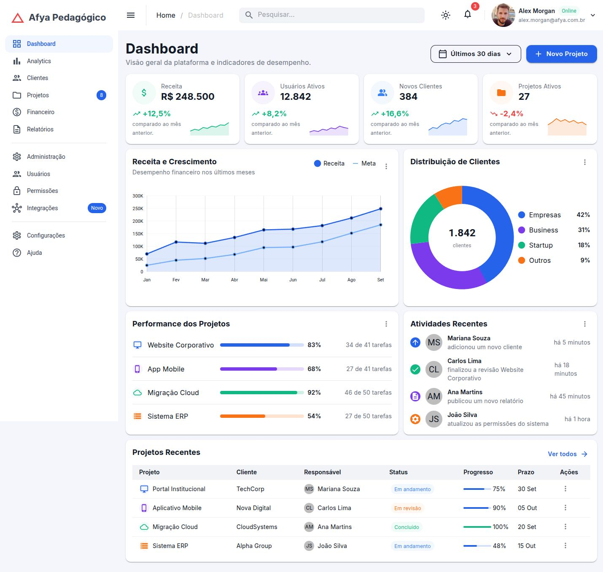
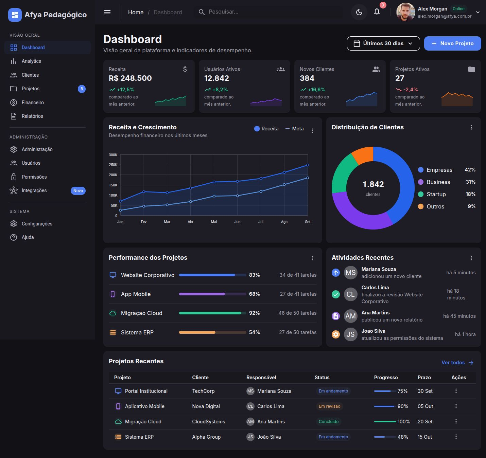
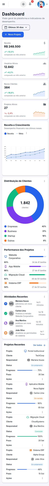
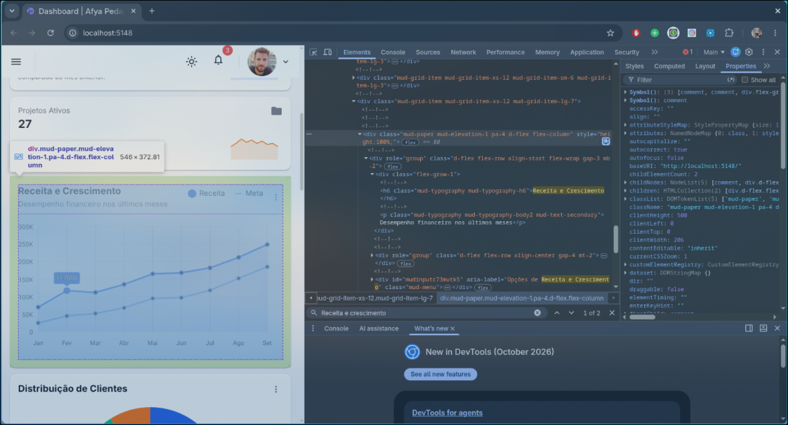

# Afya Admin — Dashboard com Blazor WebAssembly e MudBlazor

## Identificação

|                  |                               |
| ---------------- | ----------------------------- |
| **Aluno(a)**     | Jósimo Ronnyer Amaral Martins |
| **Matrícula**    | 2627678                       |
| **Faculdade**    | Afya São Lucas                |
| **Curso**        | Ciências da Computação        |
| **Disciplina**   | Programação para Sistemas Web |
| **Professor(a)** | Lilu Youd                     |
| **Semestre**     | 2026.2                        |

## Objetivo do projeto

O Afya Admin é um painel administrativo para a plataforma fictícia Afya Pedagógico. A página reúne indicadores financeiros, informações sobre clientes, andamento de projetos e atividades recentes, permitindo visualizar essas informações em um único lugar.

O dashboard apresenta quatro indicadores com pequenos gráficos de tendência, um gráfico mensal de Receita e Meta, uma distribuição de clientes por segmento, barras de performance e uma tabela de projetos. A sidebar organiza a navegação e a barra superior reúne busca, notificações, menu do usuário e alternância entre os temas claro e escuro. O layout se adapta a computadores, tablets e celulares.

O objetivo acadêmico é praticar Blazor WebAssembly, componentes Razor, parâmetros, comunicação por eventos e organização de dados. Todo o conteúdo é fictício, sem backend. O visual utiliza os componentes, o tema e os utilitários nativos do MudBlazor; não há CSS próprio para estilizar o dashboard.

Como referência visual, a interface usa cartões de indicadores mais compactos, navegação separada em grupos e um tema escuro em tons de carvão com acentos azuis e coloridos. A distribuição mantém os gráficos e as seções exigidos para esta atividade.

## Tecnologias utilizadas

- .NET SDK 10 — desenvolvimento verificado com **10.0.112**.
- Blazor WebAssembly standalone — pacotes **10.0.12**.
- MudBlazor **9.11.0** — versão 9 solicitada na atividade.
- C# e Razor.
- Git e GitHub.
- Fonte Inter, com alternativas Roboto, Helvetica, Arial e sans-serif.
- DevTools/inspeção do navegador para verificação do HTML e da responsividade.

As versões dos pacotes estão fixadas no projeto e registradas em `packages.lock.json` para tornar a restauração reproduzível. O perfil fictício do dashboard usa a imagem de Astro Boy enviada pelo aluno, com o nome Tetsuwan Atom.

## Como executar

É necessário instalar o **SDK .NET 10**, não apenas o runtime. Confira com `dotnet --version`; a versão deve começar com `10.`. A versão utilizada na validação foi `10.0.112`.

```bash
git clone https://github.com/lmvv0o/afya-admin.git
cd afya-admin
dotnet restore --locked-mode
dotnet watch
```

Abra a URL mostrada no terminal. O perfil HTTP deste projeto usa `http://localhost:5147`. Se essa porta estiver ocupada, encerre a aplicação que a utiliza ou execute `dotnet watch --urls http://localhost:5148`.

Para verificar a compilação separadamente:

```bash
dotnet build
```

O template MudBlazor não precisa estar instalado para executar um clone. Ele foi usado para criar o projeto com `dotnet new mudblazorwasm -o afya-admin`.

Ao salvar alterações, o `dotnet watch` tenta aplicar Hot Reload. Se a mudança exigir reinicialização, aceite o reinício no terminal ou pressione `Ctrl + R`. `Ctrl + C` encerra a execução. Em ambientes Linux com limite de observadores de arquivos atingido, use:

```bash
DOTNET_USE_POLLING_FILE_WATCHER=1 dotnet watch
```

## Telas

### Tema claro



### Tema escuro



### Versão mobile



### HTML gerado (DevTools)



O componente inspecionado foi o `MudPaper` do `DashboardCard` de **Receita e Crescimento**. Ele gerou uma `<div>` com as classes `mud-paper mud-elevation-1 pa-4 d-flex flex-column`. As duas primeiras são adicionadas pelo componente; as demais são utilitários passados pelo parâmetro `Class`. O parâmetro `Height="100%"` gerou `style="height:100%;"` automaticamente: trata-se de saída do componente, não de CSS escrito na aplicação. O título virou um `<h6>` com `mud-typography mud-typography-h6`.

O fragmento do DOM está em [docs/html-dashboard-card.html](docs/html-dashboard-card.html). No print, a aba **Elements** mostra o `div` do `MudPaper` selecionado, suas classes e o card correspondente destacado na página.

## Estrutura do projeto

```text
afya-admin/
├── Components/
│   ├── AtividadesRecentes.razor
│   ├── CabecalhoPagina.razor
│   ├── DashboardCard.razor
│   ├── GraficoDistribuicaoClientes.razor
│   ├── GraficoReceita.razor
│   ├── KpiCard.razor
│   ├── PerformanceProjetos.razor
│   ├── ProjetosRecentes.razor
│   ├── SeletorPeriodo.razor
│   └── Ui.cs
├── Data/
│   └── DashboardData.cs
├── Layout/
│   ├── MainLayout.razor
│   └── NavMenu.razor
├── Pages/
│   ├── Dashboard.razor
│   └── NotFound.razor
├── Properties/
│   └── launchSettings.json
├── wwwroot/
│   ├── css/app.css
│   ├── img/tetsuwan-atom.png
│   ├── favicon.png
│   ├── icon-192.png
│   └── index.html
├── docs/
│   ├── prints/
│   │   ├── tema-claro.png
│   │   ├── tema-escuro.png
│   │   ├── mobile.png
│   │   └── devtools.png
│   ├── html-dashboard-card.html
│   └── verificacao.md
├── .gitignore
├── _Imports.razor
├── afya-admin.csproj
├── App.razor
├── packages.lock.json
├── Program.cs
└── README.md
```

- **Components:** componentes reutilizáveis da interface e auxiliares de apresentação.
- **Data:** cinco modelos em `record` e os dados fictícios apresentados na página.
- **Layout:** moldura compartilhada, tema, sidebar, AppBar e navegação.
- **Pages:** componentes com rota; Dashboard na raiz e NotFound para páginas inexistentes.
- **wwwroot:** arquivos estáticos, HTML de entrada, foto e CSS original do template para carregamento/erro.
- **Properties:** perfis e URLs utilizados no desenvolvimento.
- **docs:** capturas, fragmento do HTML inspecionado e registro das verificações.

`Program.cs` registra os serviços e inicia a aplicação. `App.razor` define o roteamento. `_Imports.razor` reúne os namespaces compartilhados. `bin/` e `obj/` são gerados localmente e ignorados pelo Git.

## Componentes criados

| Componente                    | Responsabilidade                                                   | Parâmetros que recebe                                                                     |
| ----------------------------- | ------------------------------------------------------------------ | ----------------------------------------------------------------------------------------- |
| `DashboardCard`               | Estrutura reutilizável de card com título, ações, menu e conteúdo. | `Titulo: string`, `Subtitulo: string?`, `Acoes`, `Menu` e `ChildContent: RenderFragment?` |
| `KpiCard`                     | Valor do indicador, ícone, variação e sparkline.                   | `Kpi: Kpi`                                                                                |
| `CabecalhoPagina`             | Título, subtítulo e ações da página.                               | `Titulo: string`, `Subtitulo: string?`, `Acoes: RenderFragment?`                          |
| `SeletorPeriodo`              | Menu de períodos e comunicação da seleção à página.                | `Opcoes: IReadOnlyList<string>`, `Valor: string`, `ValorChanged: EventCallback<string>`   |
| `GraficoReceita`              | Gráfico mensal de Receita e Meta, legenda e menu.                  | `Meses: string[]`, `Receita: double[]`, `Meta: double[]`                                  |
| `GraficoDistribuicaoClientes` | Gráfico de rosca, total central e legenda com percentuais.         | `Total: int`, `Segmentos: IReadOnlyList<SegmentoCliente>`                                 |
| `PerformanceProjetos`         | Barras, percentuais e tarefas concluídas dos projetos.             | `Projetos: IReadOnlyList<ProjetoPerformance>`                                             |
| `AtividadesRecentes`          | Feed com ações, pessoas, iniciais e tempos fictícios.              | `Atividades: IReadOnlyList<Atividade>`                                                    |
| `ProjetosRecentes`            | Tabela responsiva de projetos e menus de ações.                    | `Projetos: IReadOnlyList<ProjetoRecente>`                                                 |
| `MainLayout`                  | Tema, providers, AppBar, sidebar e área principal.                 | `Body: RenderFragment`, herdado de `LayoutComponentBase`                                  |
| `NavMenu`                     | Links, ícones, separadores e badges da sidebar.                    | Nenhum parâmetro próprio                                                                  |

`Ui.cs` é uma classe auxiliar, não um componente Razor. `FundoSuave(Color)` retorna a classe nativa para o fundo do ícone e `Iniciais(string)` gera as iniciais dos avatares.

## O que aprendi

> Texto de apoio elaborado durante a implementação assistida. Antes da entrega, o aluno deve revisar estas explicações e reescrevê-las com suas próprias palavras, conforme solicitado pelo professor.

**1. Como uma aplicação Blazor WebAssembly inicia no navegador?**

O navegador começa carregando wwwroot/index.html, que contém a <div id=app> e a indicação de carregamento. O script do Blazor baixa o runtime .NET para WebAssembly e os arquivos necessários à aplicação. O runtime executa Program.cs, que registra os serviços e associa App ao elemento #app. O conteúdo inicial é substituído pelo componente App, cujo roteador escolhe a página correspondente à URL e a apresenta dentro do layout.

**2. Qual é a diferença entre Layout, Page e Component?**

O Layout define a moldura compartilhada: MainLayout contém sidebar, AppBar e o espaço @Body para a página. Uma Page possui uma rota; Dashboard usa @page "/" para responder pela raiz. Um Component é um bloco reutilizável que recebe parâmetros e não precisa de rota, como KpiCard, usado quatro vezes com indicadores diferentes. Embora todos sejam componentes Razor, essas funções organizam suas responsabilidades.

**3. O que é um RenderFragment e como DashboardCard o utiliza?**

RenderFragment representa um trecho de interface que o componente recebe por parâmetro. O DashboardCard cria a estrutura comum e oferece Acoes, Menu e ChildContent para quem o utiliza preencher com marcação e outros componentes. Assim, a Receita pode inserir legenda e gráfico, enquanto a tabela insere um botão e MudTable, sem repetir a estrutura do card. O subtítulo e o menu são opcionais.

**4. Como funciona @bind-Valor e qual é o papel de ValorChanged?**

O binding utiliza a convenção de um parâmetro Valor acompanhado de ValorChanged, do tipo EventCallback<string>. A página fornece \_periodo ao seletor e, quando uma opção é escolhida, o seletor executa ValorChanged.InvokeAsync(opcao). O Blazor atualiza a variável da página e envia o novo valor ao componente. O seletor comunica a escolha; a página permanece dona do estado. Nesta versão, isso atualiza apenas o texto da seleção.

**5. Por que separar os dados em Data?**

A pasta Data concentra os modelos e valores fictícios, enquanto os componentes descrevem sua apresentação. A página entrega os dados por parâmetros, evitando que cada card dependa diretamente de uma lista estática. Se futuramente as informações vierem de uma API, a página ou um serviço poderá carregar esses mesmos modelos e repassá-los aos componentes. Isso reduz a necessidade de alterar os blocos visuais, desde que seus contratos continuem compatíveis.

**6. Como MudGrid reorganiza os KPIs?**

O grid divide a largura em 12 colunas. Cada KPI usa xs="12", ocupando a linha inteira no celular; sm="6", permitindo dois cards por linha a partir de 600px; e lg="3", permitindo quatro a partir de 1280px. Cada configuração vale até a próxima substituição. Dessa forma, os mesmos quatro componentes se reorganizam conforme a largura disponível, sem regras CSS próprias.

**7. Como estilizar sem escrever CSS?**

Os parâmetros controlam características como sombra, altura, cor, tamanho e aparência dos componentes. O MudTheme concentra paletas, tipografia e medidas compartilhadas; o MudThemeProvider aplica essas configurações ao alternar claro e escuro. Utilitários como pa-4, d-flex, flex-grow-1 e mud-text-secondary resolvem espaçamento, alinhamento e cores de apoio. Os atributos SVG do texto central da rosca também seguem o tutorial, usando currentColor para acompanhar o tema.

**8. Por que o namespace é afya_admin?**

O hífen não é permitido em identificadores C#, pois representa o operador de subtração. Ao criar o projeto com o nome externo afya-admin, o SDK utiliza afya_admin como namespace válido. A pasta, o repositório e o arquivo .csproj mantêm o hífen; os namespaces e imports do código usam sublinhado, como afya_admin.Components e afya_admin.Data.

## Dificuldades e soluções

Os problemas abaixo foram observados durante a implementação e os testes assistidos deste projeto.

**1. Menus personalizados não abriam.** A página compilava, mas clicar no sino e no usuário não abria os menus. A documentação XML do pacote instalado mostrou que, no MudBlazor 9.11, o ActivatorContent recebe um MenuContext e exige a chamada explícita a ToggleAsync`. Foram adicionados os eventos nos ativadores, incluindo Enter e espaço. A correção foi verificada abrindo notificações e os itens Perfil, Configurações e Sair no navegador.

**2. Identificação do usuário não desaparecia no celular.** O MudStack adicionava d-flex, que prevalecia sobre d-none e mantinha nome e e-mail visíveis, ocupando a AppBar além da largura disponível. A solução foi colocar o stack dentro de uma <div class="d-none d-md-flex">, mantendo todos os estilos nativos. Em 390px, o avatar permanece visível e os dados textuais ficam ocultos.

**3. Sidebar apresentava rolagem horizontal.** Os divisores tinham largura total e margens laterais na mesma tag, ultrapassando a área da gaveta. As margens foram transferidas para um contêiner externo e os divisores mantiveram o espaçamento vertical. A largura de conteúdo da sidebar passou a coincidir com sua largura de 280px, sem CSS próprio.

**4. Observadores de arquivos no Linux atingiram o limite.** O dotnet watch encontrou o limite de instâncias de inotify do ambiente. A execução com DOTNET_USE_POLLING_FILE_WATCHER=1 permitiu continuar com Hot Reload sem alterar configurações globais do sistema.

## Melhorias futuras (opcional)

- Implementar páginas adicionais e breadcrumb dependente da rota.
- Fazer a seleção de período atualizar os indicadores.
- Filtrar a tabela pelo texto de busca.
- Substituir dados estáticos por JSON e depois por um serviço/API.
- Salvar a preferência de tema no navegador.
- Implementar cadastro, edição, detalhes e exportação.

Esses recursos não estão implementados nesta atividade. Os links de páginas adicionais mostram NotFound e as ações demonstrativas apenas compõem a interface. O total da rosca é formatado em `pt-BR`; a Meta usa cor mais clara, conforme o tutorial. Alguns valores fictícios de progresso e prazo da tabela foram completados porque as linhas correspondentes estão cortadas no PDF.

## Verificação e entrega

As verificações realizadas estão em [docs/verificacao.md](docs/verificacao.md). A implementação foi desenvolvida com assistência do Codex, com commits reais durante as etapas; não foi importado um projeto pronto. Os quatro prints exigidos estão incluídos, com a inspeção real do DevTools. A revisão pessoal das respostas do README permanece necessária para atender à exigência de escrever com suas próprias palavras.

Prazo informado: **5 de outubro de 2026**, sem horário especificado. Os pesos fornecidos somam 85%; o peso do critério de aprendizado e dificuldades não foi informado e deve ser confirmado com o professor.
